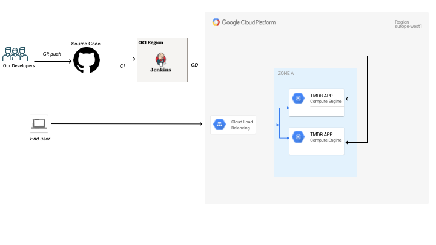

# TMDB CHALLENGE

I have created a highly available web application utilizing both Oracle Cloud and Google Cloud to host the TMDB App.

## Reference Architecture 
The final reference architecture after the terraform deployment on both clouds.

## Deployment Steps

**Each Directory has its own README.md for instructions**

1. Run the terraform code in the [tmdb-infra](./tmdb-IaC/gcp/tmdb-infra) directory to create all the Infra needed for the APP (**Task 2**)
2. Run the terraform code in the [Jenkins-Server](./tmdb-IaC/oci/Jenkins-Server) directory to create a Jenkins server to host your CI/CD platform (For this task I used Github actions since I don't have credit on OCI) (**TASK 1**)
3. Use the [tmdb-keys](./tmdb-keys) directory for accessing the servers hosted in the cloud, although I added the private key to **1Password** for security purposes (**TASK 4**)
4. Health checks have been added using docker compose for restarting the services automatically, found in [docker-compose.yml](tmdb-app/docker-compose.yml) (**TASK 4**)

## Project Workflow

1. The developer pushes code to the develop branch as the main branch is disabled for direct pushes for security.
2. After review by at least 2 reviewers, the code can be merged into the main branch.
3. GitHub Actions/Jenkins Server runs the CI pipeline to integrate and test the approved code.
4. Once all tests are completed successfully, the pipeline deploys the updated code on the 2 backend servers one by one.
5. While the first server updates, the load balancer routes the traffic to the second healthy server.
6. When the first server is successfully updated, the second server gets the updates while traffic is routed to the first server by the load balancer.
7. Finally, we can have our Solution updated in an end-to-end fully automated manner while putting security and high availability into perspective.

## App URLS (GCP Credentials will be shared using 1Password for security)
All app servers could be sshed into using the private key shared with 1Password

**Server1** http://34.38.125.238

**Server2** http://34.140.33.232

**Public LB** http://35.210.19.156